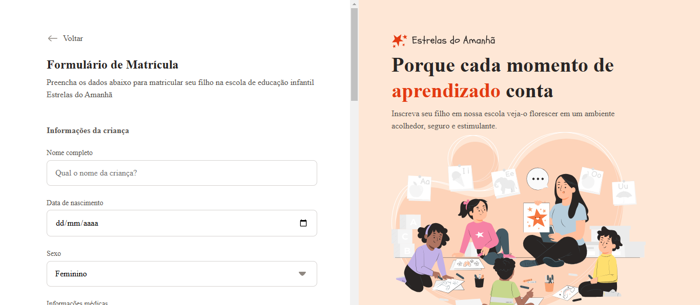

<h1 align="center">Formulário de Matrícula</h1>

O projeto de formulário de matrícula, abordando campos de entrada de texto, data, seleção, text area e envio de arquivos. Vamos focar em customizar inputs desafiadores como radio e checkbox. Além disso, vamos organizar os arquivos e ícones em pastas, exportar elementos como SVG e ajustar o layout do projeto. 
<a href="https://app.rocketseat.com.br/">Estude esse projeto em formato de vídeo clicando aqui.</a>

  <a href="#-tecnologias">Tecnologias</a>&nbsp;&nbsp;&nbsp;|&nbsp;&nbsp;&nbsp;
  <a href="#-projeto">Projeto</a>&nbsp;&nbsp;&nbsp;|&nbsp;&nbsp;&nbsp;

 

  

## 🚀 Tecnologias

Esse projeto foi desenvolvido com as seguintes tecnologias:

- HTML e CSS
- Figma

## 💻 Projeto

O Projeto é a criação de um formulário onde estou abordando campos de entrada de texto, data, seleção, text area e envio de arquivos. Vamos focar em customizar inputs desafiadores como radio e checkbox. Além disso, vamos organizar os arquivos e ícones em pastas, exportar elementos como SVG e ajustar o layout do projeto.

- [Acesse o projeto finalizado, online](https://editonr.github.io/formulario_matricula/)

---

Um projeto ensinado com ♥ by Rocketseat e replicado com carinho by Eddie ♥ : [Participe da nossa comunidade!](https://discord.gg/rocketseat)